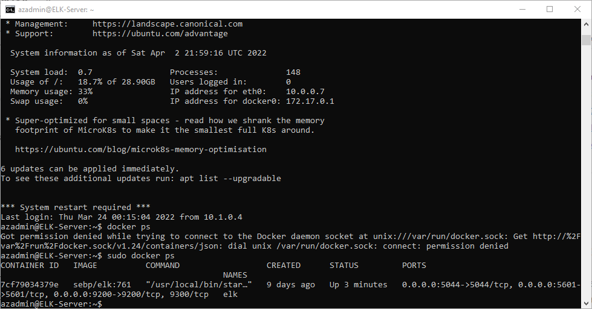

## Automated ELK Stack Deployment

The files in this repository were used to configure the network depicted below.

Images/ELK Network Diagram.png

These files have been tested and used to generate a live ELK deployment on Azure. They can be used to either recreate the entire deployment pictured above. Alternatively, select portions of the Yaml file may be used to install only certain pieces of it, such as Filebeat.

  -install-elk.yml

This document contains the following details:
- Description of the Topology
- Access Policies
- ELK Configuration
  - Beats in Use
  - Machines Being Monitored
- How to Use the Ansible Build

### Description of the Topology

The main purpose of this network is to expose a load-balanced and monitored instance of DVWA, the D*mn Vulnerable Web Application.

Load balancing ensures that the application will be highly accessable, in addition to restricting acess to the network.
- Load Balancers help keep the system highly available.  The Jump Box gives centralized control of the installed software.

Integrating an ELK server allows users to easily monitor the vulnerable VMs for changes to the log and system files.
- Filebeat watches for changes to log files.
- Metricbeat records the changes to the system files.

The configuration details of each machine may be found below.
_Note: Use the [Markdown Table Generator](http://www.tablesgenerator.com/markdown_tables) to add/remove values from the table_.

| Name     | Function | IP Address | Operating System |
|----------|----------|------------|------------------|
| Jump Box | Gateway  | 10.1.0.4   | Linux            |
| Web-1    | Web      | 10.1.0.11  | Linux            |
| Web-2    | Web      | 10.1.0.12  | Linux            |
| Web-3    | Web      | 10.1.0.14  | Linux            |
| ELK      | ELK      | 10.0.0.7   | Linux            |

### Access Policies

The machines on the internal network are not exposed to the public Internet. 

Only the EKJ machine can accept connections from the Internet. Access to this machine is only allowed from the following IP addresses:
- 66.41.235.31

Machines within the network can only be accessed by Jump Box.

A summary of the access policies in place can be found in the table below.

| Name     | Publicly Accessible | Allowed IP Addresses |
|----------|---------------------|----------------------|
| Jump Box | Yes                 | 66.41.235.31         |
| Web-1    | No                  | 10.1.0.4             |
| Web-2    | No                  | 10.1.0.4             |
| Web-3    | No                  | 10.1.0.4             |
| ELK      | Yes                 | 66.41.235.31         |
|          |                     |                      |

### Elk Configuration

Ansible was used to automate configuration of the ELK machine. No configuration was performed manually, which is advantageous because there are no human mistakes and configuration is repeatable.

The playbook implements the following tasks:
- Install the Docker.io
- Install Python3-pip
- Install the Docker Module
- Increase usable memory
- Download and launch elk container
- Set docker to load on boot.

The following screenshot displays the result of running `docker ps` after successfully configuring the ELK instance.

### Target Machines & Beats
This ELK server is configured to monitor the following machines:
- 10.1.0.11
- 10.1.0.12
- 10.1.0.14

We have installed the following Beats on these machines:
- Filebeat
- Metricbeat

These Beats allow us to collect the following information from each machine:
- Filebeat monitors the log files and forwards them to Elasticsearch or Logstash for indexing.
- Metricbeat monitors the metrics from the operating system and sends the data to Elastisearch or Logstash for indexing.

### Using the Playbook
In order to use the playbook, you will need to have an Ansible control node already configured. Assuming you have such a control node provisioned: 

SSH into the control node and follow the steps below:
- Copy the yaml files to Ansible container.
- Update the hosts file to include the correct IP addresses for your Web servers and ELK servers.
- Run the playbook, and navigate to the web address to check that the installation worked as expected.
